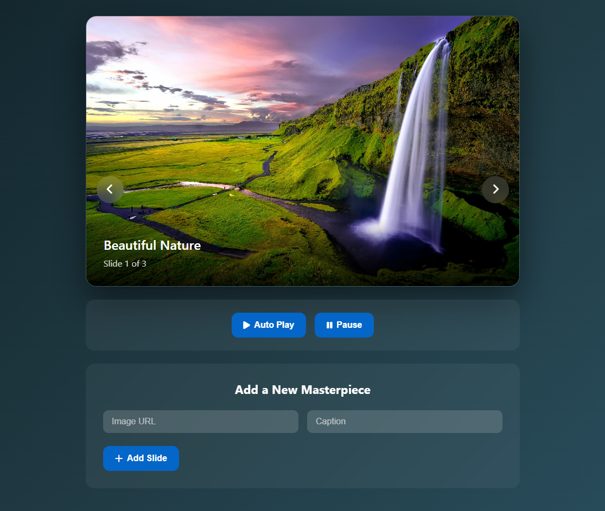
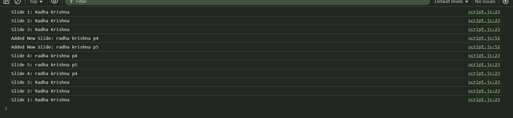

# 📸 Smart Image Slider  

A modern and fully customizable **Smart Image Slider** built with **HTML, CSS, and JavaScript**.  
This project features smooth navigation, auto-play with pause/play controls, and the ability to dynamically add new slides with captions.  

---

## 🚀 Features  

- 🔄 **Navigation**: Previous & Next buttons with smooth transitions.  
- ▶️⏸️ **Auto Play / Pause** functionality.  
- ➕ **Add New Slides** by entering an image URL and caption.  
- 🎨 **Modern UI Design** with glassmorphism effect.  
- 📊 **Slide Counter** to display the current slide number.  
- 🖼️ **Dynamic Captions** displayed beautifully over each slide.  

---

## 📂 Project Structure  

Smart-Image-Slider/  
│── index.html # Main HTML file  
│── style.css # Stylesheet (Glassmorphism design)  
│── script.js # JavaScript functionality  
│── imgs/ # Local images (nature.png, mountain.png, forest.png)  
│── README.md # Project Documentation  

---

## 🖼️ Screenshots  

### 🎯 Main Output  

### 🛠️ Console Logs  

---

## ⚡ How to Use  

1. Clone or download the repository.  
2. Open index.html in any browser.

Use:
      -> ⏪ Prev / Next buttons to navigate slides.
      -> ▶️ Auto Play to start automatic slideshow.
      -> ⏸️ Pause to stop slideshow.

Add Slide Section to insert a new image with a caption.

## 📌 Tech Stack

HTML5 – Structure  
CSS3 – Styling with glassmorphism & animations  
JavaScript (Vanilla) – Functionality & Interactions  
Font Awesome – Icons  

## 👨‍💻 Author

Sahil Nerpagar 
📌 Project Owner  

