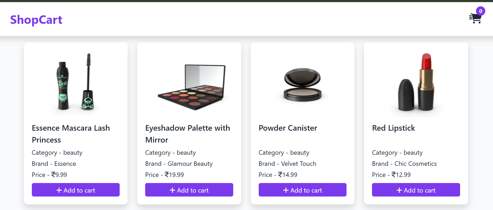
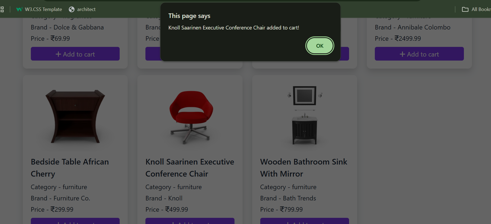
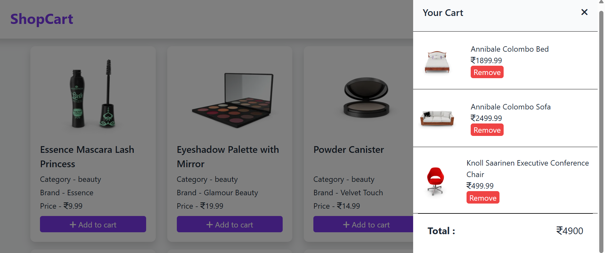

🛒 Shopping Cart System

A simple shopping cart web application built using HTML, CSS, JavaScript (jQuery), Bootstrap 5, and Font Awesome.

📌 Features

🧾 Product listing section (dynamically populated).

🛍️ Add products to the cart.

➕➖ Increase / decrease product quantity.

🗑️ Remove items from the cart.

💰 Auto-updated total amount.

📊 Cart item counter in the navbar.

📱 Responsive design with Bootstrap 5.

🚀 Technologies Used

Frontend: HTML5, CSS3, Bootstrap 5

Icons: Font Awesome

JavaScript: jQuery

Custom Styling & Logic: style.css, script.js

📂 Project Structure
/project-folder
│── index.html        # Main HTML file
│── style.css         # Custom styles
│── script.js         # Cart functionality (JS logic)

⚙️ Setup Instructions

Clone or download the project.

Open index.html in a browser.

Make sure you have an internet connection (for Bootstrap, jQuery & Font Awesome CDN).

Add your own products dynamically via script.js.

🎯 Future Improvements

Add product search functionality.

Save cart items in LocalStorage.

Add a checkout system.

Connect to a backend API / database.

📸 screenshot:

   

👨‍💻 Author,

Created by Sahil Nerpagar..

 

