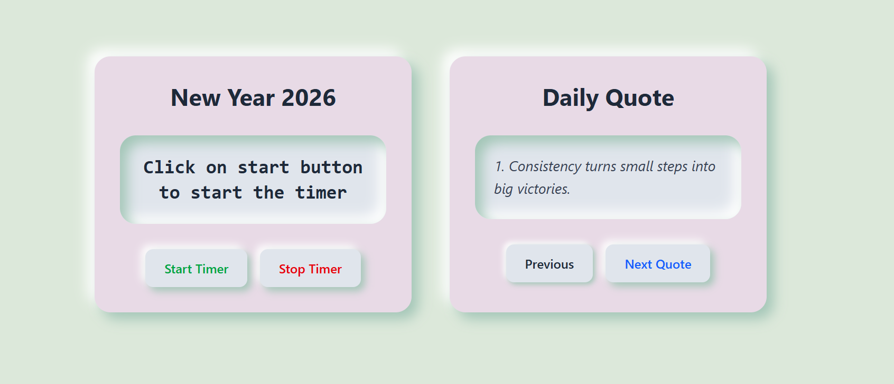

# Countdown and Quotes App

## Problem Definition

The goal of this project is to create a dynamic and visually appealing web application that serves two main purposes:
1.  A countdown timer that shows the time remaining until a specific event (in this case, the New Year).
2.  A quote slider that displays inspirational quotes to the user.

The application should be interactive, allowing users to start and stop the countdown and navigate through the quotes. It should also feature a modal window for displaying messages to the user.

## Step-wise Explanation

1.  **HTML Structure**: The foundation of the app is built with HTML. The `index.html` file defines the structure, including containers for the countdown timer, the quotes slider, and the modal popup.

2.  **Styling with Tailwind CSS**: The app is styled using Tailwind CSS. The classes are used to create a modern, responsive design. The project has been through several design iterations, including a dark theme, a light theme, and a neumorphic theme.

3.  **JavaScript Logic**: The `script.js` file contains the logic for the app's functionality:
    *   **Countdown Timer**: A `setInterval` function is used to update the countdown every second. The time remaining is calculated by finding the difference between the current date and the target date (New Year's Day).
    *   **Quotes Slider**: An array of quotes is stored in the JavaScript file. The `next()` and `prev()` functions allow the user to navigate through the quotes by updating the index of the current quote.
    *   **Modal**: The modal is hidden by default. The `showModal()` function is used to display messages to the user, and the `hideModal()` function closes it.

## Screenshots

### Web View

👨‍💻 Author,

Created by Sahil Nerpagar..

