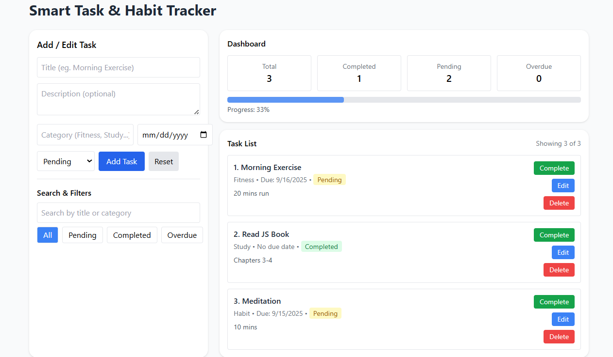

# 💻 Project: Smart Task & Habit Tracker

 📝 Project Definition

💡 Objective:

 - To create a JavaScript-based interactive dashboard that allows users to add, edit, delete, and mark tasks/habits as complete. All updates happen in real-time on the web page using DOM manipulation, with data stored only in JavaScript memory (arrays/objects). No backend or persistent storage is used.

🧩 Project Flow

📝 Task & Habit Input

1. User adds tasks via a form on the web page (Title, Description, Category, Due Date, Status).
2. Each task is stored as an object in an array.
3. Tasks are dynamically rendered on the page using DOM methods like createElement, appendChild, and innerHTML.

✅ Mark Complete / Delete Task

1. Each task card has Complete and Delete buttons.
2. On click, the array is updated in memory, and the task list is re-rendered.

📊 Real-Time Dashboard

- Dynamically calculate:
1. Total tasks
2. Completed tasks
3. Pending tasks
4. Overdue tasks

* Update dashboard section in real-time using DOM and template literals.

🔍 Search & Filter Tasks

1. Search tasks by title or category using an input field.
2. Filter tasks by status: Completed / Pending / Overdue.
3. Updates happen instantly on the page without page reload.

🛠️ OOP Task Management (Class & Methods)

1. Task class handles task creation, editing, deletion, and marking complete.
2. Optional: SpecialHabit class extends Task to demonstrate inheritance.
3. All methods update the array and re-render the DOM dynamically.

✅ Final Dashboard Summary

Displayed on the page:
1. Total tasks
2. Completed tasks
3. Pending tasks
4. Overdue tasks
5. Use template literals for clear summary and real-time updates.

💡 Example Output (Rendered on Page):
Task List:

1. Morning Exercise - Pending - [Complete] [Delete]
2. Read JS Book - Completed - [Complete] [Delete]
3. Complete Assignment - Pending - [Complete] [Delete]

Dashboard:
Total Tasks: 3
Completed: 1
Pending: 2
Overdue: 0
Progress: 33%

📚 JavaScript Concepts Covered:
1. DOM Manipulation (querySelector, createElement, appendChild, innerHTML, addEventListener)
2. Arrays & Objects (store tasks in memory)
3. Loops (for, for…of)
4. Functions (task operations: add, edit, delete, complete)
5. Classes & OOP (Task class, inheritance, encapsulation, polymorphism)
6. ES6 Features (let, const, arrow functions, template literals)
7. Conditional Statements (task status, overdue calculation)
8. Responsive UI using Tailwind + media queries

scrennshot:

👨‍💻 Author,

Created by Sahil Nerpagar..
