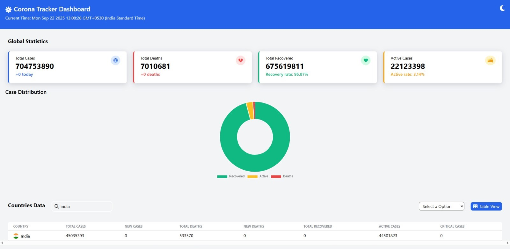
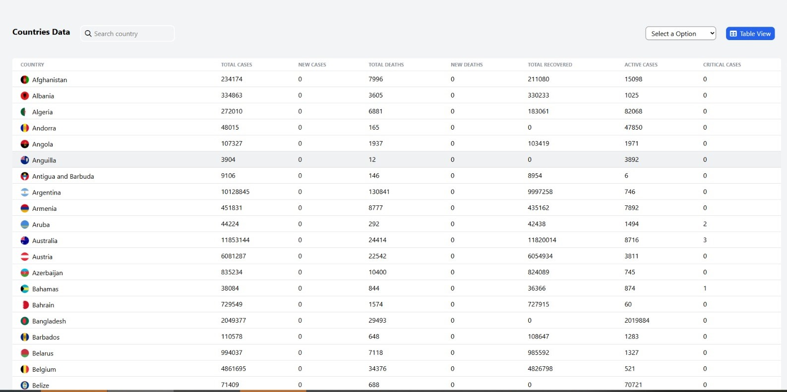

# 🦠 Corona Tracker App

A simple and responsive web application that provides real-time COVID-19 statistics for countries across the world. Built using HTML, CSS, and JavaScript with API integration.

---

## 🌐 Live Demo

👉 [Visit Corona Tracker](https://corona-api-js-project.netlify.app/)

---

## 🚀 Features

- 🌍 Real-time COVID-19 statistics
- 🔍 Country-wise data search
- 📊 Dynamic data rendering using API
- 📱 Fully responsive for all devices
- ⚡ Fast and lightweight UI
- 💡 Simple and clean dashboard layout

---

## 🛠 Tech Stack

- HTML5
- CSS3
- JavaScript (Vanilla)
- REST API Integration
- DOM Manipulation
- Bootstrap (for layout)

---

# 🔗 API Used

- [COVID-19 API](https://covid19api.com/)

---

## 📂 Folder Structure

```
corona-api-js-project/
├── index.html
├── style.css
├── script.js
└── README.md
```

---

## 🧠 Learning Outcome

- Mastered working with APIs and real-time data
- Practiced DOM manipulation techniques
- Built a responsive UI without using React
- Strengthened debugging and JS data-handling skills


# output

 

👨‍💻 Author,

Created by Sahil Nerpagar..


---
