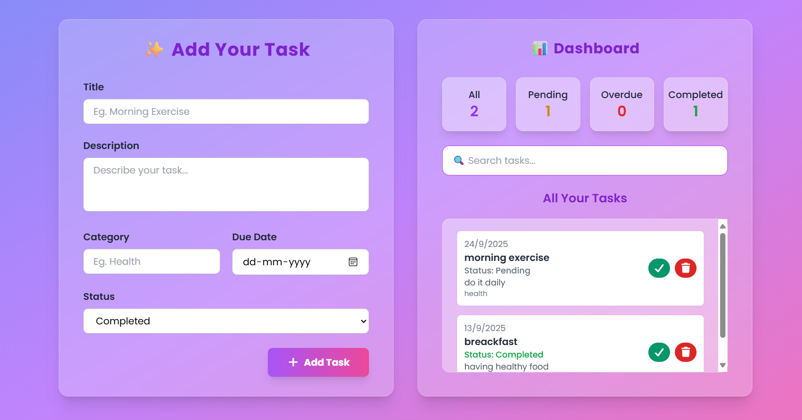

# 📝 TASK Manager

A modern **task & habit management web app** built with **HTML + TailwindCSS**.  
It helps users **add tasks, categorize them, set due dates, and track progress** in a beautiful dashboard with a modern glassmorphism theme.

---

## ✨ Features

- ➕ **Add Tasks** with title, description, category, due date, and status.
- 📊 **Dashboard Overview** with counts for:
  - All tasks
  - Pending tasks
  - Overdue tasks
  - Completed tasks
- 🔍 **Search Functionality** to quickly filter tasks.
- 🎨 **Modern UI Design** with gradient background & glass effect.
- 📱 **Responsive Layout** (works on mobile, tablet, desktop).
- ⚡ **Smooth Interactions** with Tailwind hover & transition effects.

---

## 🛠️ Tech Stack

- **Frontend:** HTML, TailwindCSS (via CDN)
- **Icons:** Font Awesome
- **Font:** Google Fonts (Poppins)

---

## 📂 Project Structure

project-folder/  
│  
├── index.html # Main page (UI + Tailwind classes)  
├── script.js # App logic (add, search, filter tasks)  
└── README.md # Documentation  

Change gradient colors in <body>:

<body class="bg-gradient-to-br from-indigo-400 via-purple-400 to-pink-400">

Replace Google Font in <head> with your choice.

Modify status colors in the dashboard section:
 -> Pending → Yellow  
 -> Overdue → Red  
 -> Completed → Green  

## 📸 Preview

## 👨‍💻 Author

Created by **Sahil Nerpagar**
