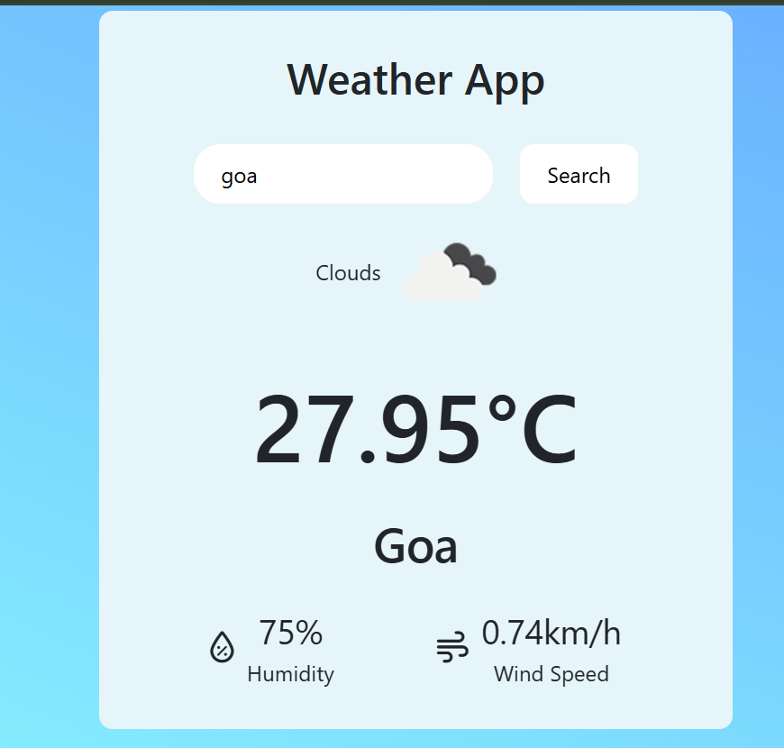
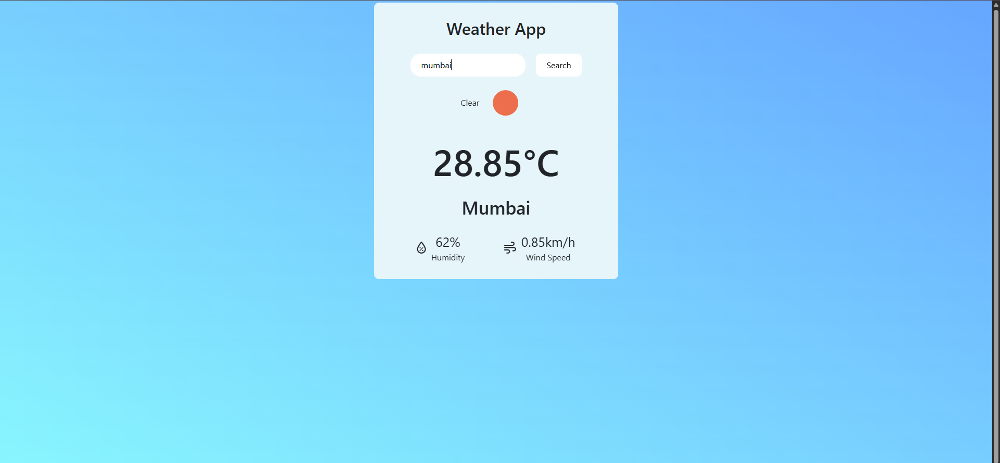
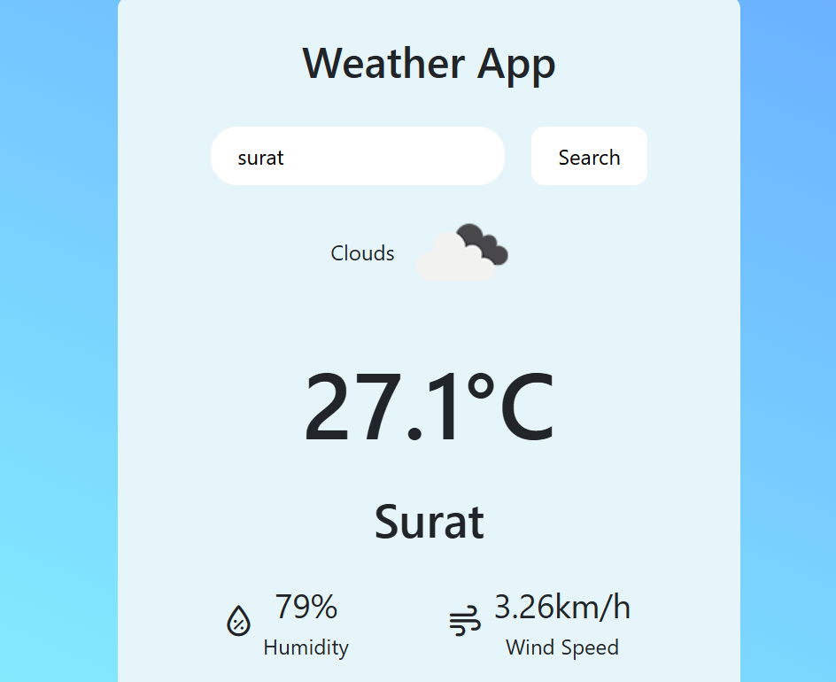

🌤️ Weather App

A modern and responsive web application to fetch and display real-time weather information for any city. Built with HTML, CSS, JavaScript, and Bootstrap, this app is perfect for learning API integration and DOM manipulation.

🚀 Features

🔍 Search for any city worldwide to get current weather conditions.

⚠️ Displays an error message and image if the city is not found.

📱 Fully responsive design using Bootstrap 5.

🎨 Clean and simple UI with Font Awesome icons for better UX.

🌐 Real-time data from a weather API.

🛠️ Technologies Used
Technology	Purpose
HTML5	Structure of the web page
CSS3	Styling and layout
JavaScript	API requests & DOM manipulation
Bootstrap 5	Responsive design
Font Awesome	Icons for UI enhancement
📁 Folder Structure
Weather-App/
│
├── index.html        # Main HTML file
├── style.css         # Custom CSS styles
├── script.js         # JavaScript logic
├── images/           # Folder for images (e.g., city-error.jpg, banner.png)
└── README.md         # Project documentation

🎯 How to Use

Clone or download the repository.

Open index.html in your web browser.

Enter the name of a city in the input field.

Click Search to fetch weather information.

If the city is invalid, an error image and message will appear.

🌟 Demo

(Add a gif or screenshot of your app here to make it visually appealing.)

⚠️ Notes

Ensure you have an internet connection for the weather API to work.

Make sure the images folder contains city-error.jpg for error display.

You can customize the design by editing style.css.

📜 License

This project is open-source and free to use for personal and educational purposes.

output:

  

👨‍💻 Author,

Created by Sahil Nerpagar..

 

